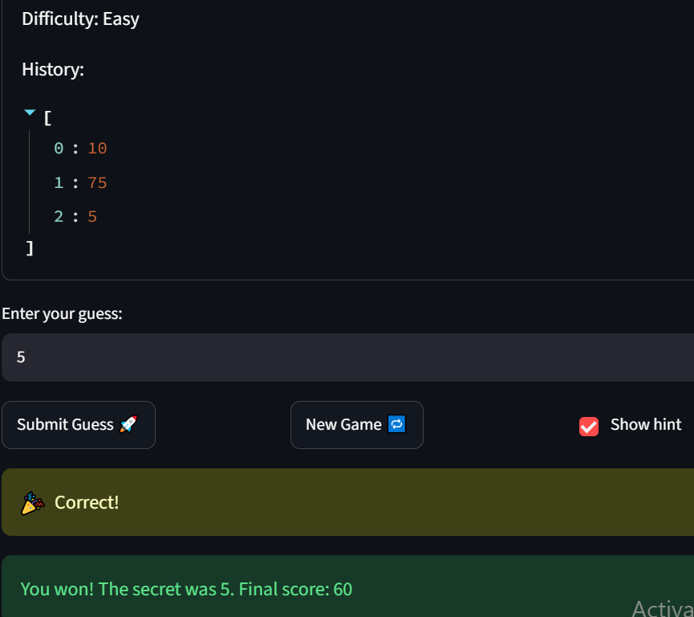

# 🎮 Game Glitch Investigator: The Impossible Guesser

## 🚨 The Situation

You asked an AI to build a simple "Number Guessing Game" using Streamlit.
It wrote the code, ran away, and now the game is unplayable. 

- You can't win.
- The hints lie to you.
- The secret number seems to have commitment issues.

## 🛠️ Setup

1. Install dependencies: `pip install -r requirements.txt`
2. Run the broken app: `python -m streamlit run app.py`

## 🕵️‍♂️ Your Mission

1. **Play the game.** Open the "Developer Debug Info" tab in the app to see the secret number. Try to win.
2. **Find the State Bug.** Why does the secret number change every time you click "Submit"? Ask ChatGPT: *"How do I keep a variable from resetting in Streamlit when I click a button?"*
3. **Fix the Logic.** The hints ("Higher/Lower") are wrong. Fix them.
4. **Refactor & Test.** - Move the logic into `logic_utils.py`.
   - Run `pytest` in your terminal.
   - Keep fixing until all tests pass!

## 📝 Document Your Experience

- [x] Describe the game's purpose.
The purpose of the game is to allow the student the opportunity to gain exposure working alongside AI to solve a faulty coding program. In essence, the coding program itself is simple. It implements a basic CS 101 guess-a-number game, with guess hints included and a simple UI using Streamlit. A secret number is generated, the user guesses a number, and a coding comparison is completed to determine which hint is offered to the user, if the user has not already won the game or run out of attempts.
- [x] Detail which bugs you found.
On startup, the first bug I noticed was that the game defaults to Normal, which allows 8 guesses; however, attempts left was already showing 7 before the user makes a single guess. The next bug I saw was that, if I changed the difficulty level to Easy or Hard, two things happened: the secret number would sometimes fall outside the range allowed for the difficulty, and the pre-printed guidance "pick a number 1–100" remained the same. As the user plays the game, once a guess was submitted, the attempts left did not change until after the user had made another guess.
- [x] Explain what fixes you applied.
I will write these as bullets to avoid redundancy, because the fixes are:
- already marked as comments in the code as #FIXME and #FIX
- described thoroughly in reflection.md
Fixes applied included:
- hint now matches the result -> too high says go LOWER, too low says go HIGHER
- compare as numbers (not text) and give the matching hint direction
- corrected logic by adding OR st.session_state.get("secret_difficulty") != difficulty
- corrected secret number logic to use variable value difficulty
- corrected on startup, attempts left initialization value
- FIX: replaced hardcoded "1 and 100" with the {low}/{high} variables so the message matches the actual difficulty range
- count now reflects the post-guess state because the submit handler increments attempts then calls st.rerun(), so this redraws from the fresh value instead of the stale pre-guess one
- added logic to set the secret number based on the difficulty
- reset status to "playing" (and clear stashed feedback) so a finished game can actually be replayed; the old code left status as "won"/"lost", so the game-over guard kept stopping the new game
- render feedback stashed by the previous run's submit BEFORE the game-over guard, so the detailed win / "Out of attempts!" text (and balloons) survive st.rerun() instead of being replaced by the generic game-over message
- FIX: stash the error instead of incrementing attempts here, so a blank/non-numeric guess no longer burns an attempt
- FIX: increment moved into the valid-guess branch (it used to run at the top of the handler, after the display had already rendered and before input was validated), so only real guesses count and the count is fresh on the next run
- FIX: always use the number secret (it was turned into text on even turns, which broke the compare)
- re-run after processing so the whole script re-executes against the updated session_state; "Attempts left" above now redraws from the fresh count (this is what removes the off-by-one lag)

## 📸 Demo Walkthrough

Describe your fixed game in numbered steps so a reader can follow along without watching a video:

1. The app opens on **Normal** difficulty. The sidebar shows "Attempts allowed: 8"
   and the banner reads "Guess a number between 1 and 100. Attempts left: 8" — the
   allowed count and the remaining count now match at the start.
2. I enter **10** and click Submit. The hint correctly says "📈 Go HIGHER!" and
   "Attempts left" immediately drops to 7 (it updates on the same guess, not one behind).
3. I enter **75** and the hint correctly says "📉 Go LOWER!"; "Attempts left" drops to 6.
4. I switch to **Easy** in the sidebar. A new secret is drawn inside 1–20 (visible in
   Developer Debug Info), and the banner updates to "Guess a number between 1 and 20."
5. I guess the secret number. The game shows "🎉 Correct!", balloons, and a win message
   with my score. (If instead I use up all attempts, it shows "Out of attempts!" exactly
   when "Attempts left" reaches 0.)


**Screenshot** *(optional)*: <!-- Insert a screenshot of your fixed, winning game here -->

## 🧪 Test Results

```

tests/test_bug3_attempts.py::test_attempts_left_decrements_on_each_submission PASSED             [  7%]
tests/test_bug3_attempts.py::test_invalid_guess_does_not_consume_an_attempt PASSED               [ 14%]
tests/test_game_logic.py::test_winning_guess PASSED                                              [ 21%]
tests/test_game_logic.py::test_guess_too_high PASSED                                             [ 28%]
tests/test_game_logic.py::test_guess_too_low PASSED                                              [ 35%]
tests/test_game_logic.py::test_fresh_game_initializes_attempts_to_zero PASSED                    [ 42%]
tests/test_game_logic.py::test_fresh_normal_game_shows_full_attempts_left PASSED                 [ 50%]
tests/test_game_logic.py::test_secret_is_always_drawn_from_difficulty_range PASSED               [ 57%]
tests/test_game_logic.py::test_too_high_guess_tells_player_to_go_lower PASSED                    [ 64%]
tests/test_game_logic.py::test_too_low_guess_tells_player_to_go_higher PASSED                    [ 71%]
tests/test_game_logic.py::test_hint_is_correct_even_when_secret_is_a_string PASSED               [ 78%]
tests/test_game_logic.py::test_guess_message_does_not_hardcode_the_range PASSED                  [ 85%]
tests/test_game_logic.py::test_guess_message_interpolates_low_and_high PASSED                    [ 92%]
tests/test_game_logic.py::test_attempt_limit_per_difficulty PASSED                               [100%]

========================================= 14 passed in 2.57s ==========================================
```

## 🚀 Stretch Features

- [ ] [If you choose to complete Challenge 4, describe the Enhanced UI changes here — a screenshot is optional]
